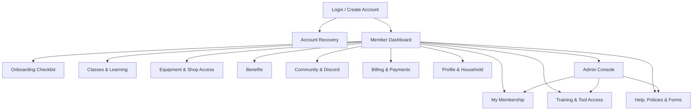

# MakerSpace Charlotte Member App IA

## Purpose

The member app should give members a clear, useful home base after they join. It should not replace the public website. The public site explains the space, helps people visit, and supports discovery. The member app handles authenticated, member-specific information and operational workflows.

Primary goals:

- Help members understand their membership, benefits, and next steps.
- Make training and shop access easier to understand.
- Centralize member resources, policies, forms, and support paths.
- Give admins a controlled place to manage member-facing account data.
- Avoid becoming the operational source of truth before the team is ready to maintain it.

## Product Boundary

| Area | Public Static Website | Member App |
| --- | --- | --- |
| Audience | Visitors, prospective members, donors, class takers | Active members, applicants, shop leads, instructors, admins |
| Access | Public | Login required |
| Content | Marketing, public classes, shops, equipment, support, FAQ | Membership status, benefits, training, resources, profile, admin workflows |
| Update model | Content files or CMS | Database/admin tools/integrations |
| Risk level | Low | Higher: auth, privacy, permissions, support burden |

Recommended URL options:

- `makerspacecharlotte.org/members`
- `members.makerspacecharlotte.org`

The member app can live in the same repository later as a separate app, but it should be treated as its own product surface.

## Current Communications Model

MakerSpace Charlotte currently uses Discord as the main community communication layer. The visible channel structure includes public onboarding and community channels such as welcome, FAQ, introductions, announcements, general, random, self-promotion, project showcase, events, instructor program, level-up, and maker-help channels such as how-can-i-help, the-big-up-fit, and pottery-faq.

Implications for the member app:

- Do not try to replace Discord in the MVP.
- Treat Discord as the live conversation and community layer.
- Use the member app as the account, status, resource, and workflow layer.
- Make Discord easy to find from onboarding, dashboard, resources, and help pages.
- Document which questions belong in Discord versus which require an official support request.
- Avoid duplicating high-churn Discord conversations inside the app unless there is a clear moderation and maintenance plan.

Potential future direction:

- If the organization later moves away from Discord, keep the member app IA flexible enough to swap the community destination.
- Community links should be modeled as editable resources rather than hard-coded assumptions.
- Official announcements may need to appear in both Discord and the member app if the app becomes a trusted member home base.

## Current Operating Assumptions

These assumptions should guide the first member app prototype and can be revised after stakeholder feedback.

| Area | Working Assumption |
| --- | --- |
| Paid member tracking | Steve, the CEO, is currently the primary owner for paid member tracking and recurring dues. |
| Membership status API | Unknown. Design the app so membership status can start as a manual/admin-managed field or imported list. |
| Family access | When a person signs up for membership, their immediate family has access to the space. |
| Community communication | Discord remains the primary community communication tool for now. |
| Account mismatches | Admins should approve or resolve account-to-membership mismatches. |
| Training authorization ownership | Admins and shop leads are the likely owners, but the MVP should avoid making this fully authoritative until ownership is confirmed. |
| Shop lead permissions | Shop leads can publish shop instructions and guidance. They should only manage member authorizations if they have explicit permission. |
| Reservations | Skip reservations for now. They add operational complexity and should not be part of the MVP. |
| Admin-only information | Keep admin-only information minimal until the team has feedback from real use. |

## Primary Roles

| Role | Job To Be Done | Needs |
| --- | --- | --- |
| Prospective member with account | Complete onboarding or follow membership next steps | Status, checklist, visit/join instructions, support |
| Active member | Find what they can use and what to do next | Membership status, benefits, training, policies, links |
| Immediate family/household member | Understand access included through a member's plan | Linked member list, access rules |
| Instructor | Manage teaching-related resources | Class links, policies, proposals, Discord channel handoff, rosters if integrated |
| Shop lead | Publish shop instructions and guidance | Shop notices, Discord channel handoff, equipment notes, training guidance |
| Authorized shop lead | Manage training/access records only when explicitly permitted | Authorization tools, approval queue, audit notes |
| Admin/operations | Support accounts and manage member data | User lookup, status overrides, audit notes, exports |
| Board/leadership | See high-level operational health | Reports, member counts, unresolved requests |

## Information Architecture



## Global Navigation

Member navigation should prioritize recurring member tasks, not marketing pages.

Primary app nav:

1. Dashboard
2. Membership
3. Training & Access
4. Classes & Learning
5. Benefits
6. Community
7. Resources

Utility nav:

- Profile
- Billing
- Help
- Sign out

Admin-only nav:

- Members
- Training
- Requests
- Content / Notices
- Reports
- Settings

## Account States

The IA should support more than just active members.

| State | Experience |
| --- | --- |
| New account, not matched | Show pending status, explain how matching works, provide support contact |
| Prospective member | Show tour/join steps, public membership info, and onboarding checklist |
| Active member | Show full dashboard, benefits, resources, and access info |
| Past due | Show renewal/payment path and what access may be affected |
| Paused/inactive | Show status, reactivation path, and contact option |
| Admin/shop lead/instructor | Show elevated tools only after role check |

## Core Sections

### Login / Create Account

Purpose:

Let a member create or access an account without making the first experience feel like a bureaucratic wall.

MVP content:

- Email-based login
- Account creation
- Account recovery
- Membership matching status
- Terms/privacy notice
- Contact path for account mismatch

Useful actions:

- Log in
- Create account
- Recover account
- Request help

Notes:

- Passwordless email login would reduce support overhead.
- Account creation should not imply active membership until matched to a real member record.

### Member Dashboard

Purpose:

Give each member a plain, useful landing page.

MVP modules:

- Membership status
- Onboarding checklist
- Next recommended action
- Benefits summary
- Training/access summary
- Quick links to handbook, policies, classes, forms, and Discord
- Notices from admins or shop leads

Later modules:

- Recent training completions
- Open requests
- Volunteer opportunities
- Member-only events
- Discord activity summary, only if there is a low-maintenance integration path

### My Membership

Purpose:

Answer "am I active, what do I get, and what do I need to do?"

MVP content:

- Membership status
- Membership type
- Join/renewal date, if available
- Renewal/payment link
- Immediate family access explanation
- Linked household/family members, if the team wants to show them
- Studio/storage status, if applicable
- Support path for membership questions

Later features:

- Plan change requests
- Pause/cancel request
- Download receipt
- Tax/donation summary, if relevant

Source-of-truth caution:

This section should mirror whatever system Steve and the team currently use to track paid memberships and recurring dues. Avoid custom payment logic until the operations process is clear.

### Training & Tool Access

Purpose:

Help members understand what they can use, what needs training, and how to get authorized.

MVP content:

- Authorized shops/tools
- Required safety classes
- Training request links
- Shop-specific access notes
- Expiration/renewal notes, if applicable
- "Ask a shop lead" contact path

Later features:

- Training completion history
- Approval workflow for admins and explicitly authorized shop leads
- Tool-specific authorization records
- Expiring authorization notifications
- Incident/safety form linkage

Key constraint:

This should only become authoritative if admins and shop leads have a reliable process for updating records. Ordinary shop lead access should be limited to publishing instructions unless that person has explicit authorization-management permission.

### Classes & Learning

Purpose:

Connect members to classes, safety training, and learning paths without introducing a reservation system.

MVP content:

- Link to public classes page
- Link to Eventbrite or current booking system
- Member discount instructions
- Required class explanations
- Shop orientation and learning-path guidance

Later features:

- Member-only classes
- Class registration history
- Waitlists
- Instructor tools
- Automatic discount eligibility

Deferred:

- Tool, room, or shop reservations are intentionally out of scope until the organization decides the operational burden is worth it.

### Equipment & Shop Access

Purpose:

Bridge the public equipment directory with member-specific access rules.

MVP content:

- Link to public equipment search
- Shop pages with member-specific access notes
- Training requirements
- Maintenance/out-of-service notices
- Shop lead contact path

Later features:

- Member-only equipment notes
- Request training for a tool
- Request shop orientation
- Tool reservation, only if truly needed
- Maintenance reports

### Benefits

Purpose:

Make membership feel tangible and reduce repeated questions.

MVP content:

- Class discount instructions
- 24/7 access expectations
- Immediate family access rules
- Studio/storage eligibility
- Member-only events
- Discord invite and channel guide
- Partner discounts, if any

Later features:

- Benefit codes
- Member-only resource downloads
- Per-member eligibility rules

### Community & Discord

Purpose:

Help members find the right place to ask questions, share projects, follow announcements, and participate in the existing MakerSpace Charlotte community.

MVP content:

- Discord invite or join instructions
- Channel guide for common needs
- Announcement channel link
- Project showcase channel link
- Events channel link
- Instructor program channel link
- Maker help channel links
- Shop/community FAQ channel links, such as pottery-faq
- Community guidelines and moderation expectations

Channel guide examples:

| Need | Suggested Destination |
| --- | --- |
| Introduce yourself | Discord introductions |
| Ask a general member question | Discord general |
| Find help with a project | Discord how-can-i-help |
| Share finished work | Discord project-showcase |
| Track announcements | Discord announcements |
| Ask pottery-specific questions | Discord pottery-faq |
| Discuss events | Discord events |
| Ask account, billing, or access-status questions | Member app support request |

Later features:

- Sync official announcements from Discord or an admin notice tool
- Show current Discord invite state
- Role-based Discord onboarding instructions
- Admin-managed community link directory

Boundary:

The member app should not ingest or mirror general Discord conversations by default. That would create privacy, moderation, and maintenance questions without solving the core member-account problem.

### Billing & Payments

Purpose:

Give members a clear path to manage payment without rebuilding a billing platform prematurely.

MVP content:

- Current status, if integrated
- Payment/renewal link
- Receipt/contact instructions
- Past-due explanation
- Billing support contact

Later features:

- Embedded billing portal from the payment provider
- Receipt downloads
- Payment method management
- Donation upsell, if appropriate

Implementation principle:

Prefer linking to or embedding the existing payment provider over writing custom billing.

### Profile & Household

Purpose:

Let members keep basic contact and preference information current.

MVP fields:

- Name
- Email
- Phone, optional
- Communication preferences
- Areas of interest
- Immediate family/household members, if the team wants the app to show linked access

Sensitive fields to avoid unless needed:

- Emergency contact
- Date of birth
- Address
- Government ID
- Health or disability information

Privacy note:

Collect the smallest amount of data that supports a real workflow.

### Help, Policies & Forms

Purpose:

Give members one reliable place to find operational answers.

MVP content:

- Member handbook
- Shop rules
- Safety policies
- Storage/studio request forms
- Volunteer signup
- Teach-a-class form
- Donation/material request link
- Contact paths by topic
- Discord channel guide for conversational support

Later features:

- Searchable resource library
- Role-based documents
- Form status tracking
- Internal knowledge base for admins/shop leads

### Admin Console

Purpose:

Support staff, volunteers, and shop leads without exposing admin tools to ordinary members.

MVP tools:

- Member lookup
- Account matching/approval
- Role assignment
- Membership status override or notes, if needed
- Manual membership status import/update, if no API exists yet
- Resource link management
- Announcement/notices management
- Shop instruction publishing controls

Phase 2 tools:

- Training authorization management
- Request queue
- Explicit permission grants for shop leads who can manage authorizations
- Export/import tools
- Audit notes

Phase 3 tools:

- Reports
- Instructor tools
- Incident/safety workflow
- Integration sync status

## Key Workflows

### New Member Onboarding

1. Member creates account.
2. System tries to match account to membership record.
3. If matched, dashboard shows onboarding checklist.
4. Member reviews immediate family access rules, handbook, Discord, access expectations, and training next steps.
5. Member follows shop orientation or required training instructions.

### Account Not Matched

1. Member creates account.
2. No active membership record is found.
3. App shows pending state and explains possible reasons.
4. Member can submit a support request.
5. Admin reviews and links account manually.

### Training Request

1. Member opens Training & Tool Access.
2. Member chooses shop/tool.
3. App shows required class or request form.
4. Admin or explicitly authorized shop lead reviews request.
5. Authorization is updated, or the member is routed to training.

### Billing Issue

1. Member sees inactive or past-due status.
2. App links to payment/renewal provider.
3. Member updates payment externally.
4. Status syncs automatically if an integration exists, or Steve/admins review manually.

### Admin Account Support

1. Admin searches by name/email.
2. Admin reviews member status and account match.
3. Admin updates role/status or adds a support note.
4. Member sees updated state on next login.

## Suggested MVP

The first version should be small enough to build and maintain.

MVP scope:

- Login/create account
- Basic dashboard
- Membership status display or manual approval status
- Immediate family access explanation
- Member resources
- Benefits and discount instructions
- Training/access explanation
- Profile basics
- Admin account matching
- Discord invite/channel guide
- Shop instruction publishing for permitted shop leads

Defer:

- Custom billing
- Door access integration
- Tool reservations
- Full training records
- Member directory
- Project showcase
- Complex reporting
- Any Discord replacement

## Data Model Sketch

Initial records:

- User
- Member profile
- Membership status
- Role
- Household relationship
- Shop instruction
- Training authorization
- Resource link
- Announcement
- Support request

Potential integrations:

- Payment/member management provider, if Steve's current dues workflow exposes one
- Eventbrite or class booking system
- Door/access control system
- Email provider
- Discord, currently used as the primary community platform
- Airtable/Google Sheets for interim operational data

## Technical Direction

Recommended structure if this becomes an app:

```text
apps/
  www/       # Astro public static site
  members/   # Authenticated member app
packages/
  ui/        # Shared components and brand tokens
docs/
```

Good candidate stacks:

- Next.js or React Router for the member app if it becomes highly interactive.
- Astro with server islands/actions if the portal stays simple.
- Supabase, Clerk, Auth0, Firebase, or a membership-specific platform for auth.
- Hosted Postgres/Supabase/Firebase for member-specific records.

The exact stack should follow the existing membership/payment system. Authentication and member status should be selected together, not separately.

## Open Questions

- What specific system does Steve use to track paid members and recurring dues?
- Does that system have an export, webhook, or API for membership status?
- Which Discord channels are official enough to link from the app?
- Who owns Discord moderation, channel cleanup, and invite management?
- Who owns training authorization data in practice: admins, shop leads, or both?
- Which shop leads, if any, should receive authorization-management permissions?
- What information must be visible to admins only?

## Phasing Recommendation

Phase 0: Plan and validate

- Review this IA with staff, shop leads, and a few active members.
- Confirm Steve's membership/dues tracking workflow and whether it has an export or API.
- Confirm training authorization ownership.
- Decide what the app must know versus what it can link to.

Phase 1: Lightweight member hub

- Login
- Dashboard
- Resources
- Benefits
- Discord invite/channel guide
- Manual or imported membership status
- Admin account matching
- Immediate family access explanation
- Shop instruction publishing

Phase 2: Trusted member status

- Integrate with membership/payment source of truth.
- Show accurate active/past-due/inactive state.
- Add billing handoff.
- Improve onboarding checklist.

Phase 3: Operational workflows

- Training/access records
- Explicitly permissioned shop lead authorization tools
- Requests
- Notices
- Reports

Phase 4: Advanced member value

- Reservations only if future member feedback proves the operational need
- Member directory, opt-in only
- Project showcase, opt-in only
- Instructor tools
- Deeper integrations
