# MakerSpace Charlotte IA Redesign

## Goal

Make the site answer the practical visitor questions quickly:

- What is MakerSpace Charlotte?
- Can I visit before joining?
- What does membership include?
- What shops, tools, and classes are available?
- How do I donate, volunteer, sponsor, or contact someone?

The rebuilt IA should separate action paths from background information. The current site has good content, but visitors have to infer the path from repeated copy, external Eventbrite links, and pages that blur together.

## Primary Audiences

| Audience | Main Job | Site Needs |
| --- | --- | --- |
| Prospective member | Decide whether to visit and join | Pricing, access, shops, tour process, address, expectations |
| Class taker | Find and book a class | Upcoming classes, safety requirements, Eventbrite handoff |
| Maker with a project | Confirm tools and shop fit | Shop pages, equipment lists, access/training requirements |
| Donor or sponsor | Understand impact and give | Donation options, nonprofit story, wishlist, sponsorship contact |
| Volunteer/instructor | Offer help or teach | Volunteer needs, teach-a-class form, contact path |
| Existing member | Find operational info fast | Hours/access, policies, links, contact, class calendar |

## Proposed Top-Level Navigation

Primary nav:

1. Visit
2. Membership
3. Explore
4. Classes
5. Support
6. About

Explore menu:

- Shops & Tools
- Equipment Search

Primary CTA:

- Book a Tour

Member utility action:

- Member Login

Footer utility links:

- Contact
- FAQ
- Donate
- Member Login
- Equipment Search
- Address / map
- Social links
- Member resources, if available

This keeps the top nav focused on visitor decisions. Contact and FAQ stay available, but they stop competing with higher-intent paths.

## Sitemap

```mermaid
flowchart TD
  Home["Home"]
  Visit["Visit"]
  OpenHouse["Open House & Tours"]
  PlanVisit["Plan Your Visit"]
  Membership["Membership"]
  Studios["Studios & Storage"]
  Handbook["Member Handbook / Policies"]
  Shops["Shops & Tools"]
  Equipment["Equipment Search"]
  Wood["Woodworking"]
  Metal["Metal, Welding & Blacksmithing"]
  Digital["Digital Fabrication"]
  Textiles["Textiles & Cosplay"]
  Pottery["Pottery & Ceramics"]
  Bike["Bike Shop"]
  Photo["Photography Studio"]
  Classes["Classes"]
  Upcoming["Upcoming Classes"]
  Safety["Safety & Authorization Classes"]
  Teach["Teach a Class"]
  Support["Support"]
  Donate["Donate"]
  Wishlist["Wishlist / Material Donations"]
  Volunteer["Volunteer & Sponsor"]
  About["About"]
  Mission["Mission & Nonprofit"]
  Team["Team / Board"]
  Press["Press"]
  Contact["Contact"]
  FAQ["FAQ"]
  Members["Member Portal"]
  Login["Login / Create Account"]
  Dashboard["Member Dashboard"]
  Benefits["Benefits & Discounts"]
  Authorizations["Shop Authorizations"]
  Profile["Member Profile"]
  Resources["Member Resources"]

  Home --> Visit
  Home --> Membership
  Home --> Shops
  Home --> Equipment
  Home --> Classes
  Home --> Support
  Home --> About
  Home --> Members
  Visit --> OpenHouse
  Visit --> PlanVisit
  Membership --> Studios
  Membership --> Handbook
  Shops --> Wood
  Shops --> Metal
  Shops --> Digital
  Shops --> Textiles
  Shops --> Pottery
  Shops --> Bike
  Shops --> Photo
  Shops --> Equipment
  Classes --> Upcoming
  Classes --> Safety
  Classes --> Teach
  Support --> Donate
  Support --> Wishlist
  Support --> Volunteer
  About --> Mission
  About --> Team
  About --> Press
  About --> Contact
  About --> FAQ
  Members --> Login
  Members --> Dashboard
  Dashboard --> Benefits
  Dashboard --> Authorizations
  Dashboard --> Profile
  Dashboard --> Resources
```



## Static Site + Member Portal Model

The public website can remain static even if members eventually have accounts. Treat these as two connected products:

1. Public website: fast, static, low-maintenance, focused on visitors, classes, membership, support, and trust.
2. Member portal: authenticated, data-driven, focused on members, benefits, account status, resources, and operational workflows.

Recommended URL pattern:

- Public site: `makerspacecharlotte.org`
- Member portal: `makerspacecharlotte.org/members` or `members.makerspacecharlotte.org`

The member portal should not be required for casual visitors to understand the space, book a tour, donate, or browse classes.

## Equipment Database MVP

The public static site should include a searchable equipment directory for prospective members who need to confirm whether the space supports a project before visiting.

MVP approach:

- Store equipment as an Astro content collection.
- Render a static `/equipment/` page.
- Filter records in the browser by search text, shop, category, and status.
- Link each equipment record back to its related shop page.
- Show shop-specific equipment records on shop detail pages.

Initial equipment fields:

- Name
- Shop
- Category
- Summary
- Keywords
- Manufacturer/model, if useful
- Quantity
- Status: available, limited, training required, or ask on tour
- Access requirements
- Training required
- Related classes
- Last verified date
- Public notes

This should stay an MVP until shop leads review the data. Once the data model is trusted, the same collection can be moved behind Pages CMS, Decap CMS, Airtable, or another editing system without changing the visitor-facing IA.

### Why Keep Them Separate

- A static public site is easier to host, faster, cheaper, and harder to break.
- Authenticated member features require security, permissions, account recovery, data storage, and privacy decisions.
- Separating the portal lets the public site launch first while the account system grows in phases.
- If the portal changes vendors or data models later, the public website does not need a full rebuild.

### Member Portal Principles

- Do not ask users to create an account unless there is a clear benefit.
- Avoid collecting sensitive data until there is an operational reason.
- Prefer integrations or links to existing systems for payments, class booking, door access, or member management before rebuilding those systems.
- Keep public marketing content editable separately from member data.
- Make member status and benefits visible, but avoid making the portal the source of truth unless the operations team is ready to maintain it.

## Member Account IA

### Member Login / Create Account

Purpose:

Let members create or access an account tied to their membership.

Required sections:

- Login
- Create account
- Passwordless or email-based login, if possible
- Account recovery
- Terms/privacy notice
- Contact path for membership/account mismatch

### Member Dashboard

Purpose:

Give members a useful home base after login.

Potential modules:

- Membership status
- Next renewal date, if integrated
- Member benefits
- Class discount instructions
- Upcoming member events
- Required safety classes or shop authorizations
- Studio/storage status, if applicable
- Quick links to forms, policies, Slack/Discord/Facebook, Eventbrite, donation page, and contact

### Benefits & Discounts

Purpose:

Make membership feel tangible and reduce repeated questions.

Potential content:

- Class discount information
- Family access explanation
- 24/7 access rules
- Partner discounts, if any
- Studio/storage eligibility
- Member-only events

### Shop Authorizations

Purpose:

Show what a member is cleared to use and what training is needed next.

Potential content:

- Authorized shops/tools
- Required safety class links
- Training request path
- Expiration or renewal notes, if applicable

This should only become a source of truth if the makerspace has a reliable process for updating authorizations.

### Member Profile

Purpose:

Let members maintain basic account information.

Potential fields:

- Name
- Email
- Phone, optional
- Emergency contact, only if operationally needed
- Interests / shops
- Household members, if family membership needs tracking
- Communication preferences

### Member Resources

Purpose:

Centralize links and documents for existing members.

Potential content:

- Member handbook
- Shop rules
- Safety policies
- Forms
- Storage/studio requests
- Volunteer signups
- Class proposal form
- Contact paths by topic

## Member Portal Feature Phases

### Phase 0: Static Public Site

Launch the public redesign without accounts.

Included:

- Public IA
- Tour booking
- Membership information
- Shops and tools
- Classes/Eventbrite links
- Donation/support paths
- FAQ and contact

### Phase 1: Lightweight Member Hub

Add a simple login-protected resource area.

Included:

- Account creation/login
- Member dashboard
- Member resource links
- Benefits and discount instructions
- Profile basics

This phase can work even if membership status is manually approved or imported.

### Phase 2: Member Status Integration

Connect the portal to the system that knows who is actually a member.

Included:

- Active/inactive membership status
- Renewal/payment link
- Class discount eligibility
- Studio/storage status, if available

Avoid custom payment logic unless there is a strong reason. Link to or integrate with the payment/member-management system already used by the organization.

### Phase 3: Operational Features

Add workflow features once the team knows what it can maintain.

Possible features:

- Shop authorization tracking
- Training requests
- Volunteer shifts
- Tool reservations, if needed
- Incident/safety forms
- Member directory, opt-in only
- Project showcases, opt-in only

## Technical Direction

Recommended architecture:

- Static public site built from content files or a lightweight CMS.
- Authenticated member portal using a hosted auth/database provider or existing membership platform.
- Shared design system so the portal feels like part of the same brand.
- Clear data ownership: public content, member identity, membership status, class booking, and payments may live in different systems.

Good fit:

- Astro for the public static site because it keeps most pages static and only hydrates interactive components when needed.
- A separate React/Next/Astro app for member accounts.
- Supabase, Clerk, Auth0, Firebase, or a membership-specific platform for authentication, depending on budget and existing systems.

Decision to make before choosing tools:

- What system currently tracks paid members?
- What system currently handles dues?
- Does door/access control have an export or API?
- Does Eventbrite handle class discounts cleanly?
- Who will approve accounts and fix login problems?
- Is the portal for convenience, or will it become operationally authoritative?

## Static Website Stack

Recommended public-site stack:

- Astro
- TypeScript
- Astro content collections
- Markdown / MDX / YAML content files
- Tailwind CSS
- Vanilla JavaScript for small interactions
- Pagefind for static site search, if search becomes useful
- Netlify or Cloudflare Pages for hosting
- GitHub for source control
- Pages CMS, Decap CMS, or similar Git-based CMS for nontechnical editing

### Why Astro

Astro is a strong fit for the public website because most pages should render to static HTML. The site can stay fast and simple while still allowing selective interactive components where useful, such as filters, search, forms, or future member-portal handoffs.

Astro content collections are especially useful for this project because shops, classes, FAQs, support options, and team/press entries all have predictable fields. Those records can live as Markdown, MDX, YAML, or JSON files and be rendered into static pages at build time.

### Why Not Next.js for the Public Site

Next.js could work, but it is more app-oriented than this static public site needs. If the member portal becomes a React-heavy application later, Next.js may be a good fit there. For the public marketing/content site, Astro is simpler and ships less client-side JavaScript by default.

### Styling

Use Tailwind CSS with a small set of project-level design tokens:

- colors
- typography
- spacing
- buttons
- cards
- shop/category badges
- form styles
- alert/announcement styles

Avoid making every page a custom design. The public site should use reusable templates and components so content editors cannot accidentally break layout.

### Content Editing

Start with content files in the repository:

- `src/content/shops`
- `src/content/classes`
- `src/content/faqs`
- `src/content/support`
- `src/content/announcements`
- `src/content/pages`

Then add a Git-based CMS when nontechnical editing becomes a real need. A Git-based CMS is enough if updates are occasional and the team does not need complex publishing workflows. It gives editors a form-based interface while keeping the deployed site static.

Recommended CMS order:

1. Pages CMS: simple Git-backed editing UI for static-site content.
2. Decap CMS: mature Git-workflow CMS with custom content types and editorial workflow options.
3. Headless CMS later: Sanity, Contentful, or similar only if content editing becomes frequent, multi-role, or workflow-heavy.

### Hosting

Use Netlify or Cloudflare Pages.

Netlify is attractive if the team wants:

- Git-connected deploys
- deploy previews
- form handling
- redirects
- optional serverless functions later
- straightforward Astro setup

Cloudflare Pages is attractive if the team wants:

- low-cost static hosting
- strong CDN performance
- simple branch deploys
- Cloudflare DNS alignment

Either host works for the public static site. The member portal decision may influence this later.

### Forms

For the static public site, keep forms external or managed:

- tour booking: Eventbrite
- donations: PayPal
- contact: Netlify Forms, Formspree, Tally, or Google Forms
- volunteer/class proposal forms: Tally, Google Forms, or a lightweight form backend

Avoid building custom form storage until there is a clear operational workflow for who receives, triages, and resolves submissions.

### Search

Do not add search immediately unless the content grows enough to justify it. If it does, use Pagefind because it creates a static search bundle from the generated HTML and does not require hosted search infrastructure.

### Suggested Repository Shape

```text
src/
  components/
  content/
    announcements/
    classes/
    faqs/
    shops/
    support/
  layouts/
  pages/
    index.astro
    visit.astro
    membership.astro
    shops/
    classes.astro
    support.astro
    about.astro
public/
  images/
  files/
```

### Launch Stack

For the first version, keep it this small:

- Astro
- TypeScript
- Tailwind CSS
- Astro content collections
- Markdown/YAML content
- Netlify deploys from GitHub

Add later only when needed:

- Pages CMS or Decap CMS for nontechnical editing
- Pagefind for search
- Netlify Forms or a dedicated form tool
- Member portal as a separate authenticated app

## Homepage Structure

### 1. Hero

Headline:

> Make, learn, and build in Charlotte's community workshop.

Support copy:

> MakerSpace Charlotte gives members access to 47,000 sq ft of shared shops, tools, classes, studios, and creative community at 1003 Louise Ave.

Primary CTA:

- Book a Tour

Secondary CTAs:

- View Membership
- Explore Shops

Quick facts in the first screen:

- Open house every Wednesday at 7pm
- Membership starts at $50/month
- 24/7 member access
- Located at 1003 Louise Ave, Charlotte, NC 28205

### 2. What You Can Do Here

Short shop preview grid:

- Woodworking
- Pottery
- Welding & metal
- 3D printing
- Laser / CNC
- Sewing & cosplay
- Bike repair
- Photography

Each card should link to either the full Shops & Tools index or a real shop detail page. No dead `#` links.

### 3. How Visiting Works

Three-step path:

1. Come to Wednesday open house
2. Tour the shops and ask project questions
3. Apply for membership or book a class

CTA:

- Reserve a Tour

### 4. Membership Preview

Content:

- $50/month
- Family access
- 24/7 facility access
- Discounted classes
- Studios and storage availability, if applicable

CTA:

- See Membership Details

### 5. Upcoming Classes

Show 3-6 upcoming classes if a feed is available. If not, show curated class categories and one button to Eventbrite.

CTA:

- View Upcoming Classes

### 6. Nonprofit Support

Content:

- Donations support tools, supplies, classes, maintenance, scholarships, and community access.

CTAs:

- Donate
- View Wishlist
- Volunteer

### 7. Location Band

Content:

- Address
- Map link
- Open house time
- Contact link

## Page Blueprints

### Visit

Purpose:

Help a first-time visitor understand exactly how to see the space.

Required sections:

- Open house details: Wednesday at 7pm
- Book a tour CTA linking to Eventbrite
- Address and map
- Parking / arrival instructions
- What to bring
- What visitors can and cannot do during a tour
- Contact path for group tours, accessibility questions, or special cases

### Membership

Purpose:

Turn interest into a confident joining decision.

Required sections:

- Price and what it includes
- Family access explanation
- 24/7 access explanation
- How to apply
- Safety/training expectations
- Studio spots and storage options
- Member expectations / community norms
- FAQ subset specific to membership

Primary CTA:

- Book a Tour

Secondary CTA:

- Contact About Membership

### Shops & Tools

Purpose:

Help visitors confirm that the space supports their project.

Index page sections:

- Short intro
- Filterable/scannable shop cards
- Training/access note
- Link to classes where training is required

Each shop page should include:

- Real photo
- What the shop is good for
- Key equipment
- Safety or class requirements
- Materials notes
- Example projects
- Related classes

Initial shop groupings:

- Woodworking
- Metal, Welding & Blacksmithing
- Digital Fabrication: 3D printing, laser, CNC
- Pottery & Ceramics
- Textiles, Sewing & Cosplay
- Bike Shop
- Photography Studio

### Classes

Purpose:

Make class discovery feel local and current before sending people to Eventbrite.

Required sections:

- Upcoming classes
- Safety/authorization classes
- Beginner-friendly classes
- Private/group class inquiry, if offered
- Teach a class CTA
- Eventbrite handoff

### Support

Purpose:

Give donors, sponsors, and volunteers clear ways to help.

Required sections:

- Financial donation with PayPal CTA
- Material/tool donation instructions
- Wishlist
- Sponsorship or corporate giving
- Volunteer opportunities
- Impact statements

Avoid:

- Donation CTAs that route to membership

### About

Purpose:

Establish trust and explain the mission.

Required sections:

- Mission
- Nonprofit status
- Story and move to Louise Ave
- Volunteer-run/community-run model
- Board/team, if publishable
- Press/media
- Contact
- FAQ

### FAQ

Purpose:

Answer practical questions, not duplicate the contact page.

Suggested categories:

- Visiting and tours
- Membership
- Classes
- Shops and safety
- Donations
- Accessibility and age/family questions
- Contact and response times

## Content Model

### Shop

Fields:

- Name
- Category
- Short description
- Hero image
- Equipment list
- Access requirements
- Required classes
- Materials allowed/provided
- Example projects
- Related classes
- Contact owner or shop lead, if public

### Class

Fields:

- Title
- Category
- Date/time
- Skill level
- Member/non-member availability
- Price
- Instructor
- Safety certification, if applicable
- Eventbrite URL
- Related shop

### Support Option

Fields:

- Name
- Type: money, tool, material, volunteer, sponsorship
- Impact statement
- CTA URL or contact path
- Tax-deductible note

## Navigation Behavior

Desktop:

- Logo left
- Primary nav centered or left-aligned
- Persistent `Book a Tour` CTA
- `Donate` can live under Support or as a secondary button if fundraising is a priority

Mobile:

- Compact menu
- Persistent or highly visible `Book a Tour` action
- Footer should repeat address, tour time, donate, contact, and social links

## Redirect / Cleanup Notes

- Make `/faq` a real FAQ page.
- Keep `/contact`, but strip FAQ placeholder language from it.
- Fix homepage donation/support links so they point to `/support/donate` or `/donate`.
- Replace shop `#` links with real shop detail pages or remove click behavior.
- Remove Webflow promotional footer links unless intentionally retained.
- Audit headings so each page has one clear H1.
- Add meaningful alt text to real images; use empty alt only for decorative assets.

## Recommended Build Phases

1. IA and content inventory
2. Low-fidelity wireframes for Home, Visit, Membership, Shops, Classes
3. Visual system and photography plan
4. Static build with editable content collections
5. Eventbrite/PayPal integration cleanup
6. Redirects, SEO, analytics, accessibility pass
